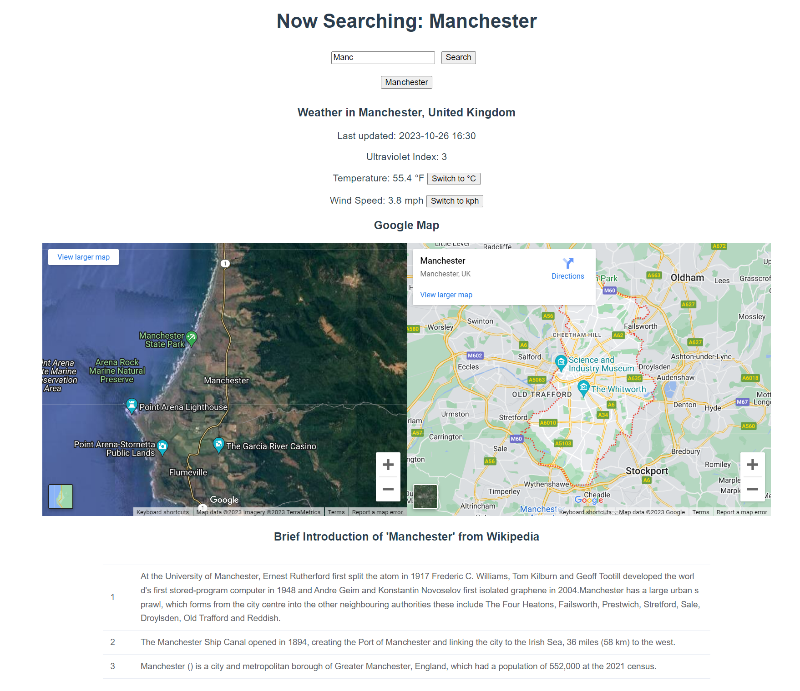
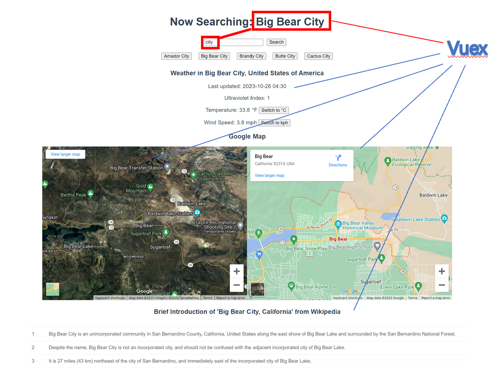

# CITY INFO ONLINE SEARCH

## Introduction

`CITY INFO ONLINE SEARCH` is a one-stop search engine for city-related information, which integrates data from a variety of Web APIs to provide comprehensive information about any city the user wishes to explore. 



## Project Design

### Application Structure

The `HelloWorld` view in the Vue.js application is structured using three main components: `WikiComponent`, `MapComponent`, and `WeatherComponent`. These components are responsible for displaying Wikipedia information, Google Maps, and weather details of the chosen city respectively.
**Each component fetches and manages its own data from the relevant APIs**, triggered when the component detects a change in the selected city in the Vuex store, ensuring modularity and separation of concerns.

### Component Details

- **MapComponent:** Utilizes Google's Maps Embed API to display 2 maps of the selected city. One map uses the latitude and longitude data stored in Vuex to find the city, while the other uses the city name. This dual method provides a more robust and accurate representation of the city.

```javascript
computed: {
    mapViewUrl() {
      console.log(this.$store.state.location)
      const { lat, lon } = this.$store.state.location;
      return `https://www.google.com/maps/embed/v1/view?key=${googleKey}
              &center=${lat},${lon}
              &zoom=12
              &maptype=satellite`;
    },
    mapPlaceUrl() {
      const place = this.$store.state.city;
      return `https://www.google.com/maps/embed/v1/place?key=${googleKey}
              &q=${place}`;
    }
  }
```

- **WeatherComponent:** Utilizes the WeatherAPI to fetch and display weather information. It shows the last updated time, the ultraviolet index, temperature, and wind speed, with options to toggle between units.

- **WikiComponent:** Uses the MediaWiki API to fetch a brief summary of the selected city from Wikipedia, which is displayed in a table format. Providing a brief summary from Wikipedia gives users a quick overview of the city. `tableData` transforms the wikiData.summary object into an array of objects suitable for rendering in a table, each with an id and summary property.

```javascript
tableData() {
      if (!this.wikiData.summary) {
        return [];
      }
      return Object.keys(this.wikiData.summary).map(key => ({
        id: Number(key) + 1,
        summary: this.wikiData.summary[key],
      }));
    },
```

### Data Management with Vuex Store

City information fetched from the GeoDB Cities API is stored in a Vuex store to maintain data consistency. The GeoDB API call is triggered when the `Search` button is clicked in the `HelloWorld` view.

```javascript
state: {
    cities: [],
    city: '',
    location: {
      lat: '',
      lon: ''
    }
  },
```
Using Vuex for state management allows all components to have a single source of truth, reducing the likelihood of data discrepancies across components. It also eliminates the need for passing data through `props`, which can become cumbersome and complex in larger applications.

### Using Vuex Instead of Props

Instead of using `props`, we use `Vuex` for the following reasons:

1. **Eliminating Prop Drilling:** Prop drilling occurs when you have to pass props through various layers of components. This can make the code harder to manage and read. With Vuex, each component can access the state directly, eliminating prop drilling.

2. **Simplifying Data Management:** When the state changes, Vuex automatically updates, and all components that rely on this state can immediately access the updated data. This simplifies data management and synchronisation across components.

3. **Reducing Component Coupling:** Using Vuex reduces the coupling between components, making the components more reusable and testable.



### User Interaction and Data Flow

1. **User Input:** User enters a city name or prefix in the search bar.

2. **City Matching:** Application calls the GeoDB Cities API to fetch potential matches.

3. **City Selection:** Matches are displayed as buttons. User selects a city from these buttons.

4. **Data Storage:** Selected city information is stored in the Vuex store.

5. **Data Fetching:** `WikiComponent`, `MapComponent`, and `WeatherComponent` **watch** for changes in the Vuex store and fetch relevant data when city information is updated.

## APIs Used

1. **Maps Embed API**: This API is used to fetch and display interactive maps of cities. [API Documentation](https://developers.google.com/maps/documentation/embed/get-started)

2. **WeatherAPI**: This API provides weather information for the chosen city. [API Documentation](https://rapidapi.com/weatherapi/api/weatherapi-com)

3. **GeoDB Cities API**: This API is utilized to fetch possible names and locations of cities typed in by users. [API Documentation](https://rapidapi.com/wirefreethought/api/geodb-cities)

4. **MediaWiki API**: This API fetches relevant Wikipedia articles for the chosen city, providing brief summaries. [API Documentation](https://rapidapi.com/dfskGT/api/wiki-briefs/)

## Implementation

`CITY INFO ONLINE SEARCH` is built using `Vue.js`, taking advantage of its component-based architecture to create reusable and manageable pieces of code. For fetching data from various APIs, we used `Axios`, a promise-based HTTP client for the browser and Node.js.

## Robustness and Data Consistency in Code Design

1. **Error Handling and Graceful Degradation:** 

The Axios request to the GeoDB API includes a `catch` block to handle any errors that might occur during the request. This ensures that the application can react to an error situation in a controlled manner.

```javascript
axios.request(options).then(response => {
  //...
}).catch(error => {
  console.error(error)
})
```

If the API request fails for any reason, the error will be caught and logged to the console, and the application will continue to function.

Additionally, the response from the GeoDB API is checked to ensure that it contains data before attempting to use it:

```javascript
if(response.data.data && response.data.data.length > 0){
  //...
}
```

This check prevents errors that would occur if `response.data.data` was `undefined` or an empty array. If the data is not as expected, the application falls back to a default state where the search city is set as the city name and other data is cleared:

```javascript
else{
  commit('SET_CITY', cityName)
  commit('SET_CITIES', [])
  commit('SET_LOCATION', null)
}
```

2. **Conditional Rendering with v-if:**

The use of the `v-if` directive in the template code ensures that components are only rendered when the necessary data is available:

```html
<div v-if="$store.state.cities && $store.state.cities.length > 0">
  <WeatherComponent></WeatherComponent>
  <MapComponent></MapComponent>
  <WikiComponent></WikiComponent>
</div>
<div v-if="$store.state.city && $store.state.cities.length == 0">
  <MapComponent></MapComponent>
  <WikiComponent></WikiComponent>
</div>
```

This helps prevent rendering errors that could occur if a component tried to access data that wasn't available yet. It also improves user experience by not displaying components until they have meaningful content to show.

3. **Data Consistency:**

The application uses Vuex to manage shared state and ensure data consistency across components. However, components also maintain their own internal consistency. For example, the `WeatherComponent` displays its own location name, even though it uses Vuex to fetch weather data:

```html
<h3>Weather in {{ weatherLocation.name }}, {{ weatherLocation.country }}</h3>
```

This shows a separation of concerns - the component is responsible for displaying its own data, while Vuex is used for fetching and storing shared data. This design pattern contributes to the robustness and maintainability of the application.

### Configuration and deployment

See ["README"](../README.md).
